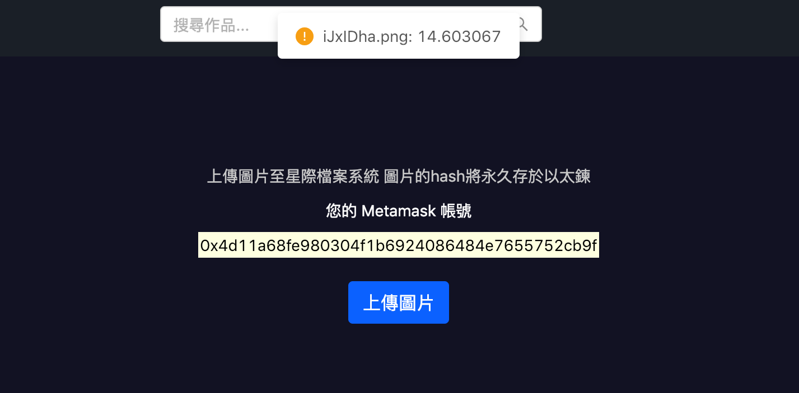

# Picture Blockchain
## About this project
**Author:** Andy Cheng
This project is an Dapp, allowiong users uploading pictures and their comments. Each user has a Metamask account, with an unique address( namely, its public key ). Also, when a user upload an image, its similarity with other images which have been uploaded will be checked and the user will be given an warning about the distance(the higher the more similar) between those's images.


Once a user login with Metamask account, he/she can start to view posts and upload images.


Personal page showing your posts.

Press the button and add a new post.


Choose a image.

Since the information of a post is stored in the blockchain, you have to confirm the transaction and pay the gas.

The transaction is successful, and a new post shows up. The image was just uploaded to IPFS

Moreover, you can press the camera icon on the navigation bar and take a photo.

Also change the filtering mode of the photo.


### Similarity Check


### Mobile
This Dapp is responsive by device width.


### Techs
Front end: React, Redux for management of states and events, react-router-dom for front-end routing, Ant Design for UI.
Blockchain: Truffle for the developement of smart contracts( Solidity ), Ganache for simulating blockchain locally.
Similarity Check: Python Falcon server framework for REST API, Docker for hosting tensorflow server.

## To run this project
### Prerequisite
- Ganache
- Metamask account
note: create a new private network with url: http://127.0.0.1:7545
- Install concurrently 
```
    npm install -g concurrently 
```

1. Download
```
    git clone https://github.com/Andy-Cheng/picture_blockchain.git
    npm install
```
2. Open Ganache, and open Metamask, connect to the private network with url: http://127.0.0.1:7545 Import an account showing in Ganache, you'll see a new account holding around 100 eth.
3. Compile Contracts and migrate to the blockchain.
``` 
    truffle compile 
    truffle migrate (For the first time, latter you have to type truffle migrate --reset)
```
**Note:** Every time you migrate the contracts, you have to reset all of your testing accounts on Metamesk.
4. Start up Dapp in localhost:3000 and local ipfs node simultaneously
```
    npm run dev 
```
or in one terminal
```
    ipfs daemon
```
and in another terminal
```
    npm start
```
5. To host servers for similarity checking, pull the image containing our servers and host tensorflow model server.
```
    docker pull chuanchung/imgsim
    docker run -d --net=host chuanchung/imgsim tensorflow_model_server --port=8500 --model_name="images" --model_base_path="/home/Imgsim-Server/inception_serving" 
```
Open another terminal and enter the container we've just run.
```
    docker exec -it [container_id] /bin/bash
``` 
Host another server for providing a REST API
```
    cd /home/Imgsim-Server/
    gunicorn -b 0.0.0.0:8000 --reload img.app
```
