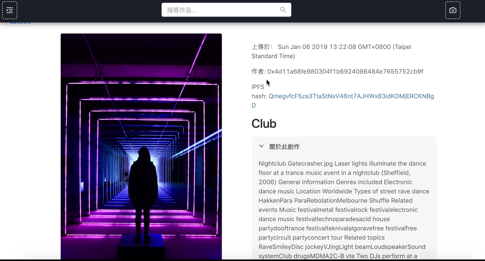

# Picture Blockchain

## About this project
This project is an Dapp, allowiong users uploading pictures and their comments. Each user has a Metamask account, with unique address( namely, public key ).


Once a user login with Metamask account, he/she can start to view posts and upload images.


Personal page showing your posts.

Press the button and add a new post.


Choose a image.

Since the information of a post is stored in the blockchain, you have to confirm the transaction and pay the gas.

The transaction is successful, and a new post shows up. The image was just uploaded to IPFS

Moreover, you can press the camera icon on the navigation bar and take a photo.

Also change the filtering mode of the photo.

### Mobile
This Dapp is responsive by device width.


### Techs
Front end: React, Redux for management of states and events, react-router-dom for front-end routing, Ant Design for UI.
Blockchain: Truffle for the developement of smart contracts( Solidity ), Ganache for simulating blockchain locally.

## To run this project
### Prerequisite
- Ganache
- Metamask account
note: create a new private network with url: http://127.0.0.1:7545

1. Download
```
    git clone https://github.com/Andy-Cheng/picture_blockchain.git
    npm install
```
2. Open Ganache, and open Metamask, connect to the private network with url: http://127.0.0.1:7545 Import an account showing in Ganache, you'll see a new account holding around 100 eth.
3. Compile Contracts and migrate to the blockchain.
``` 
    truffle compile 
    truffle migrate --reset
```
4. Start up Dapp in localhost:3000
```
    npm start (or npm run start)
```
**Author:** Andy Cheng
